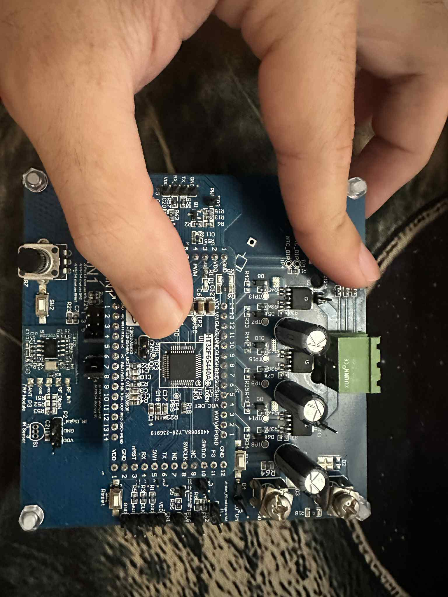

# DC Power Control Board – STM32F103

This project presents the design and implementation of a **DC power control board** based on the **STM32F103 ARM Cortex-M3 MCU**.  
It integrates power electronics with embedded firmware to achieve **motor control** and **smart load management**.

---

## 📑 Table of Contents
1. [Project Overview](#-project-overview)  
2. [Hardware Architecture](#-hardware-architecture)  
3. [Firmware Features](#-firmware-features)  
4. [Board Image & Detailed Description](#-board-image--detailed-description)  
5. [Applications](#-applications)  
6. [Skills and Technologies](#-skills-and-technologies)  
7. [Confidentiality Note](#-confidentiality-note)  

---

## 📘 Project Overview
- Designed and implemented a **DC power control board**.  
- Based on **STM32F103 microcontroller**.  
- Integrated **high-current MOSFET drivers** and **power filtering**.  
- Supported **UART/SPI communication interfaces** for external device control.  
- Developed **firmware with PWM control, GPIO handling, and system diagnostics**.  
- Applied for **motor drivers** and **smart load control systems**.  

---

## 🏗️ Hardware Architecture
- **STM32F103 MCU** (ARM Cortex-M3, 72 MHz) as the main controller.  
- **MOSFET driver stage** for high-current DC load control.  
- **Power filtering** with electrolytic capacitors for ripple reduction and system stability.  
- **UART/SPI interfaces** for debugging, communication, and integration.  
- **Screw terminals** for external DC power input/output.  
- **Voltage regulators** to supply stable 3.3V for MCU operation.  

---

## ⚙️ Firmware Features
- **PWM Generation**: motor speed control and DC power regulation.  
- **GPIO Handling**: user input, external signals, status monitoring.  
- **System Diagnostics**: fault detection (overcurrent, undervoltage, communication errors).  
- **UART/SPI Protocols**: communication with external modules or PC.  

---

## 📸 Board Image & Detailed Description

### DC Power Control Board (STM32F103-based)

**Component Breakdown:**

1. **Main MCU (STM32F103, center)**  
   - 32-bit ARM Cortex-M3 controller.  
   - Controls PWM, GPIO, communication, and diagnostics.  

2. **Pin Headers (bottom edge)**  
   - Labeled **GND, VCC, TX, RX, MOSI, MISO, SCK, RST**.  
   - Used for programming, debugging, and external module connections.  

3. **High-Current Section (right side)**  
   - **Electrolytic capacitors (x3)**: filter and stabilize DC power.  
   - **Green screw terminal**: for DC input/output to motors or loads.  
   - **MOSFETs and driver circuitry**: handle high-current switching.  

4. **Push Button (top-left corner)**  
   - Likely for **reset** or **bootloader entry**.  

5. **Miscellaneous Components**  
   - **Voltage regulators** for MCU supply.  
   - **Resistors, diodes, capacitors** for protection and signal conditioning.  
   - **Mounting holes with bolts** for fixing the board in enclosures.  

---

## 🚀 Applications
- **Motor control** (DC motors, robotics, automation).  
- **Smart load management** (IoT power devices, energy-efficient systems).  
- **DC power regulation** for industrial and consumer electronics.  
- **Embedded development platform** for testing STM32-based control systems.  

---

## 🛠️ Skills and Technologies
- **Hardware Design**: power electronics, MOSFET drivers, PCB layout.  
- **Embedded Firmware**: STM32 (C), PWM, UART, SPI, GPIO, system diagnostics.  
- **Communication Protocols**: UART/SPI for debugging and integration.  
- **Testing & Debugging**: oscilloscope analysis, serial debugging.  
- **Applications**: motor drivers, smart energy systems, automation.  

---

## 🔒 Confidentiality Note
This README provides a **high-level summary** for portfolio and presentation purposes.  
The actual project includes **advanced hardware/firmware details** that cannot be shared publicly due to **customer confidentiality policies**.
